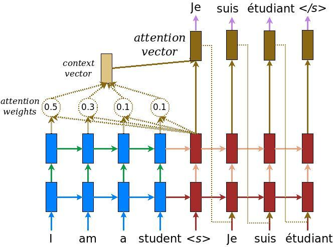

# Machine Translation Using Attention
using attention model,translate english sentence to hindi sentence 
# Attention Model
attention mechanism mainly consists of three parts 1)encoder 2)attention layer 3)decoder

# Dataset
https://www.kaggle.com/kkhandekar/hindi-english-sentence-pairs

Dataset consits of 2774 pairs of english-hindi sentences

# References:
https://www.tensorflow.org/tutorials/text/nmt_with_attention
